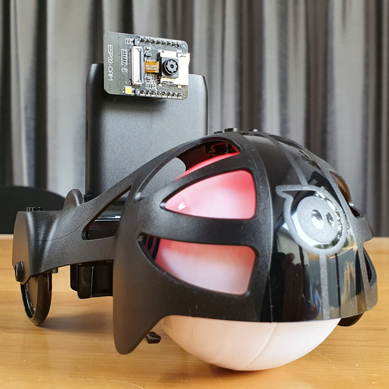
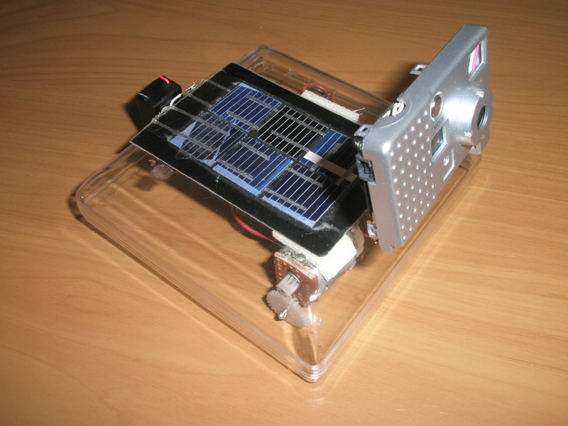

# Crashy (aka Procrastibot 2.0)

An overly-complicated nostalgic remake of a very simple robot from my past,
bringing together a Sphero 2.0 and and ESP32-CAM to fumble around smooth
surfaces, sharing pictures of everything it hits.

https://robertwallhead.com/crashy/

## Hardware

 * Sphero 2.0 (and "Chariot" accessory)
 * DFRobot ESP32-CAM Development Board (https://www.dfrobot.com/product-1879.html)

## TODO

 * Crash detection. Should only take photo if crashes. Needs configuration of
   async packets from Sphero to use.

## Credits

https://create.arduino.cc/projecthub/noah_arduino/using-esp32-cam-with-arduino-b4f12c

https://randomnerdtutorials.com/esp32-cam-take-photo-save-microsd-card/

https://randomnerdtutorials.com/esp32-cam-http-post-php-arduino/

http://www.theoldrobots.com/images48/Elmer_Elsie3.JPG

https://github.com/espressif/arduino-esp32/issues/2718#issuecomment-552213656

https://github.com/espressif/arduino-esp32/issues/3916#issuecomment-625486992

## Procrastibot 1.0

See [original](hardware/original/) folder and [Lets Make Robots
post](https://www.robotshop.com/community/forum/t/procrasti-bot/669).
